# Laporan Resmi Praktikum Jarkom Modul 2 - Kelompok IT07

| Nama              | NRP        |
| ----------------- | ---------- |
| Muhammad Afif     | 5027221032 |
| Alma Amira Dewani | 5027221054 |

## Soal

1. Soal shift dikerjakan pada `Cisco Packet Tracer` dan `GNS3` menggunakan metode perhitungan CLASSLESS yang **berbeda**.
2. Keterangan: Bila di **CPT menggunakan VLSM**, maka di **GNS3 menggunakan CIDR** atau **sebaliknya**.
3. Jika tidak ada pemberitahuan revisi soal dari asisten, berarti semua soal **BERSIFAT BENAR** dan **DAPAT DIKERJAKAN**.
4. Untuk di GNS3 `CLOUD` merupakan `NAT1` jangan sampai salah agar bisa terkoneksi internet.
5. Pembagian IP menggunakan Prefix IP yang telah ditentukan pada modul pengenalan
6. Pembagian IP dan routing harus **SE-EFISIEN MUNGKIN**.
7. Seluruh node yang ada pada topologi harus dapat **TERKONEKSI** satu sama lain dan dapat melakukan **PING** ke node lainnya yang ada di topologi
8. Gambar topologi yang lebih jelas dapat diakses pada link berikut

### Topologi CPT


### Topologi GNS


## Penyelesaian

Pembagian:

- Pada `GNS3` menggunakan `VLSM`
- Pada `CPT` menggunakan `CIDR`

### Prefix IP IT07

```bash
10.67
```

### Pelabelan Subnet


## Rute

Berikut merupakan hasil rute yang kami gunakan


## GNS3 - VLSM

### Tree

Berikut merupakan hasil pemecahan subnet besar yang akan dibentuk menjadi jaringan yang lebih ke


### Pembagian IP

Berikut adalah hasil dari pembagian IP yang telah kami peroleh dari tree sebelumnya


### Konfigurasi Network

- JAWA

```
auto lo
iface lo inet loopback

auto eth0
iface eth0 inet dhcp

#A7
auto eth1
iface eth1 inet static
address 10.67.21.185
netmask 255.255.255.252

#A15
auto eth2
iface eth2 inet static
address 10.67.21.201
netmask 255.255.255.252

#A21
auto eth3
iface eth3 inet static
address 10.67.21.205
netmask 255.255.255.252
```

- Berawang-Tempu (53 host)

```
#A1
auto eth0
iface eth0 inet static
address 10.67.20.130
netmask 255.255.255.128
gateway 10.67.20.129
```

- Enang-Enang (27 host)

```
#A1
auto eth0
iface eth0 inet static
address 10.67.20.131
netmask 255.255.255.128
gateway 10.67.20.129
```

- Starland (44 host)

```
#A1
auto eth0
iface eth0 inet static
address 10.67.20.132
netmask 255.255.255.128
gateway 10.67.20.129
```

- Sabang (6 host)

```
#A2
auto eth0
iface eth0 inet static
address 10.67.21.130
netmask 255.255.255.224
gateway 10.67.21.129
```

- Lambaro (8 host)

```
#A2
auto eth0
iface eth0 inet static
address 10.67.21.131
netmask 255.255.255.224
gateway 10.67.21.129
```

- ACEH

```
auto lo
iface lo inet loopback

#A3
auto eth0
iface eth0 inet static
address 10.67.21.178
netmask 255.255.255.252
gateway 10.67.21.177

#A1
auto eth1
iface eth1 inet static
address 10.67.20.129
netmask 255.255.255.128

#A2
auto eth2
iface eth2 inet static
address 10.67.21.129
netmask 255.255.255.224
```

- SUMATERA UTARA

```
auto lo
iface lo inet loopback

#A4
auto eth0
iface eth0 inet static
address 10.67.21.98
netmask 255.255.255.224
gateway 10.67.21.97

#A3
auto eth1
iface eth1 inet static
address 10.67.21.177
netmask 255.255.255.252
```

- Samosir (14 host)

```
#A4
auto eth0
iface eth0 inet static
address 10.67.21.99
netmask 255.255.255.224
gateway 10.67.21.97
```

- Sibandang (11 host)

```
#A4
auto eth0
iface eth0 inet static
address 10.67.21.100
netmask 255.255.255.224
gateway 10.67.21.97
```

- Sebuku (186 host)

```
#A5
auto eth0
iface eth0 inet static
address 10.67.19.2
netmask 255.255.255.0
gateway 10.67.19.1
```

- Sebesi

```
#A5
auto eth0
iface eth0 inet static
address 10.67.19.3
netmask 255.255.255.0
gateway 10.67.19.1
```

- LAMPUNG

```
auto lo
iface lo inet loopback

#A6
auto eth0
iface eth0 inet static
address 10.67.21.182
netmask 255.255.255.252
gateway 10.67.21.181

#A5
auto eth1
iface eth1 inet static
address 10.67.19.1
netmask 255.255.255.0

```

- SUMATERA

```
auto lo
iface lo inet loopback

#A7
auto eth0
iface eth0 inet static
address 10.67.21.186
netmask 255.255.255.252
gateway 10.67.21.185

#A4
auto eth1
iface eth1 inet static
address 10.67.21.97
netmask 255.255.255.224

#A6
auto eth2
iface eth2 inet static
address 10.67.21.181
netmask 255.255.255.252
```

- Bajuin (511 host)

```
#A8
auto eth0
iface eth0 inet static
address 10.67.0.2
netmask 255.255.248.0
gateway 10.67.0.1
```

- Takisung (513 host)

```
#A8
auto eth0
iface eth0 inet static
address 10.67.0.3
netmask 255.255.248.0
gateway 10.67.0.1
```

- Batakan (1020 host)

```
#A8
auto eth0
iface eth0 inet static
address 10.67.0.4
netmask 255.255.248.0
gateway 10.67.0.1
```

- Angsana (15 host)

```
#A9
auto eth0
iface eth0 inet static
address 10.67.21.66
netmask 255.255.255.224
gateway 10.67.21.65
```

- KALIMANTAN-SELATAN

```
auto lo
iface lo inet loopback

#A10
auto eth0
iface eth0 inet static
address 10.67.21.190
netmask 255.255.255.252
gateway 10.67.21.189

#A8
auto eth1
iface eth1 inet static
address 10.67.0.1
netmask 255.255.248.0

#A9
auto eth2
iface eth2 inet static
address 10.67.21.65
netmask 255.255.255.224
```

- Lamaru (468 host)

```
#A11
auto eth0
iface eth0 inet static
address 10.67.16.2
netmask 255.255.254.0
gateway 10.67.16.1
```

- Bangkirai

```
#A11
auto eth0
iface eth0 inet static
address 10.67.16.3
netmask 255.255.254.0
gateway 10.67.16.1
```

- KALIMANTAN-TIMUR

```
auto lo
iface lo inet loopback

#A12
auto eth0
iface eth0 inet static
address 10.67.21.194
netmask 255.255.255.252
gateway 10.67.21.193

#A10
auto eth1
iface eth1 inet static
address 10.67.21.189
netmask 255.255.255.252

#A11
auto eth2
iface eth2 inet static
address 10.67.16.1
netmask 255.255.254.0
```

- Selimau (200 host)

```
#A13
auto eth0
iface eth0 inet static
address 10.67.18.2
netmask 255.255.255.0
gateway 10.67.18.1
```

- KALIMANTAN-UTARA

```
auto lo
iface lo inet loopback

#A14
auto eth0
iface eth0 inet static
address 10.67.21.198
netmask 255.255.255.252
gateway 10.67.21.197

#A12
auto eth1
iface eth1 inet static
address 10.67.21.193
netmask 255.255.255.252

#A13
auto eth2
iface eth2 inet static
address 10.67.18.1
netmask 255.255.255.0
```

- KALIMANTAN

```
auto lo
iface lo inet loopback

#A15
auto eth0
iface eth0 inet static
address 10.67.21.202
netmask 255.255.255.252
gateway 10.67.21.201

#A14
auto eth1
iface eth1 inet static
address 10.67.21.197
netmask 255.255.255.252
```

- Tobelo (511 host)

```
#A16
auto eth0
iface eth0 inet static
address 10.67.8.2
netmask 255.255.248.0
gateway 10.67.8.1
```

- Ternate (511 host)

```
#A16
#A16
auto eth0
iface eth0 inet static
address 10.67.8.3
netmask 255.255.248.0
gateway 10.67.8.1
```

- Morotai

```
#A16
auto eth0
iface eth0 inet static
address 10.67.8.4
netmask 255.255.248.0
gateway 10.67.8.1
```

- MALUKU-UTARA

```
auto lo
iface lo inet loopback

#A17
auto eth0
iface eth0 inet static
address 10.67.20.2
netmask 255.255.255.128
gateway 10.67.20.1

#A16
auto eth1
iface eth2 inet static
address 10.67.8.1
netmask 255.255.248.0
```

- PC-Gorontalo (32 host)

```
#A17
auto eth0
iface eth0 inet static
address 10.67.20.3
netmask 255.255.255.128
gateway 10.67.20.1
```

- PC-Marisa (30 host)

```
#A17
auto eth0
iface eth0 inet static
address 10.67.20.4
netmask 255.255.255.128
gateway 10.67.20.1
```

- Madini (30 host)

```
#A18
auto eth0
iface eth0 inet static
address 10.67.21.2
netmask 255.255.255.192
gateway 10.67.21.1
```

- Baru (30 host)

```
#A18
auto eth0
iface eth0 inet static
address 10.67.21.3
netmask 255.255.255.192
gateway 10.67.21.1
```

- BELAWA

```
auto lo
iface lo inet loopback

#A20
auto eth0
iface eth0 inet static
address 10.67.21.163
netmask 255.255.255.248
gateway 10.67.21.161

#A18
auto eth1
iface eth1 inet static
address 10.67.21.1
netmask 255.255.255.192
```

- Galesong

```
#A19
auto eth0
iface eth0 inet static
address 10.67.21.170
netmask 255.255.255.248
gateway 10.67.21.169
```

- Topejawa-Takalar

```
#A19
auto eth0
iface eth0 inet static
address 10.67.21.171
netmask 255.255.255.248
gateway 10.67.21.169
```

- MAKASAR

```
auto lo
iface lo inet loopback

#A20
auto eth0
iface eth0 inet static
address 10.67.21.162
netmask 255.255.255.248
gateway 10.67.21.161

#A19
auto eth1
iface eth1 inet static
address 10.67.21.169
netmask 255.255.255.248
```

- SULAWESI

```
auto lo
iface lo inet loopback

#A21
auto eth0
iface eth0 inet static
address 10.67.21.206
netmask 255.255.255.252
gateway 10.67.21.205

#A20
auto eth1
iface eth1 inet static
address 10.67.21.161
netmask 255.255.255.248

#A17
auto eth2
iface eth2 inet static
address 10.67.20.1
netmask 255.255.255.128
```

### Routing

- Jawa

```
#Sumatera
route add -net 10.67.20.128 netmask 255.255.255.128 gw 10.67.21.186
route add -net 10.67.21.128 netmask 255.255.255.224 gw 10.67.21.186
route add -net 10.67.21.176 netmask 255.255.255.252 gw 10.67.21.186
route add -net 10.67.19.0 netmask 255.255.255.0 gw 10.67.21.186

route add -net 10.67.21.180 netmask 255.255.255.252 gw 10.67.21.186
route add -net 10.67.21.96 netmask 255.255.255.224 gw 10.67.21.186

#Kalimantan
route add -net 10.67.0.0 netmask 255.255.248.0 gw 10.67.21.202
route add -net 10.67.21.64 netmask 255.255.255.224 gw 10.67.21.202
route add -net 10.67.21.188 netmask 255.255.255.252 gw 10.67.21.202
route add -net 10.67.16.0 netmask 255.255.254.0 gw 10.67.21.202
route add -net 10.67.21.192 netmask 255.255.255.252 gw 10.67.21.202
route add -net 10.67.18.0 netmask 255.255.255.0 gw 10.67.21.202

route add -net 10.67.21.196 netmask 255.255.255.252 gw 10.67.21.202

#Sulawesi
route add -net 10.67.8.0 netmask 255.255.248.0 gw 10.67.21.206
route add -net 10.67.21.0 netmask 255.255.255.192 gw 10.67.21.206
route add -net 10.67.21.168 netmask 255.255.255.248 gw 10.67.21.206

route add -net 10.67.20.0 netmask 255.255.255.128 gw 10.67.21.206
route add -net 10.67.21.160 netmask 255.255.255.248 gw 10.67.21.206
```

- Sumatera

```
#A1
route add -net 10.67.20.128 netmask 255.255.255.128 gw 10.67.21.98
#A2
route add -net 10.67.21.128 netmask 255.255.255.224 gw 10.67.21.98
#A3
route add -net 10.67.21.176 netmask 255.255.255.252 gw 10.67.21.98

#A5
route add -net 10.67.19.0 netmask 255.255.255.0 gw 10.67.21.182
```

- Sumatera-Utara

```
#A1
route add -net 10.67.20.128 netmask 255.255.255.128 gw 10.67.21.178
#A2
route add -net 10.67.21.128 netmask 255.255.255.224 gw 10.67.21.178
```

- Aceh

```
route add -net 0.0.0.0 netmask 0.0.0.0 gw 10.67.21.177
```

- Lampung

```
route add -net 0.0.0.0 netmask 0.0.0.0 gw 10.67.21.181
```

- Kalimantan

```
#A8
route add -net 10.67.0.0 netmask 255.255.248.0 gw 10.67.21.198
#A9
route add -net 10.67.21.64 netmask 255.255.255.224 gw 10.67.21.198
#A10
route add -net 10.67.21.188 netmask 255.255.255.252 gw 10.67.21.198
#A11
route add -net 10.67.16.0 netmask 255.255.254.0 gw 10.67.21.198
#A12
route add -net 10.67.21.192 netmask 255.255.255.252 gw 10.67.21.198
#A13
route add -net 10.67.18.0 netmask 255.255.255.0 gw 10.67.21.198
```

- Kalimantan-utara

```
#A8
route add -net 10.67.0.0 netmask 255.255.248.0 gw 10.67.21.194
#A9
route add -net 10.67.21.64 netmask 255.255.255.224 gw 10.67.21.194
#A10
route add -net 10.67.21.188 netmask 255.255.255.252 gw 10.67.21.194
#A11
route add -net 10.67.16.0 netmask 255.255.254.0 gw 10.67.21.194
```

- Kalimantan-Timur

```
#A8
route add -net 10.67.0.0 netmask 255.255.248.0 gw 10.67.21.190
#A9
route add -net 10.67.21.64 netmask 255.255.255.224 gw 10.67.21.190

```

- Kalimantan Selatan

```
route add -net 0.0.0.0 netmask 0.0.0.0 gw 10.67.21.189
```

- Sulawesi

```
#A16
route add -net 10.67.8.0 netmask 255.255.248.0 gw 10.67.20.2
#A19
route add -net 10.67.21.168 netmask 255.255.255.248 gw 10.67.21.162
#A18
route add -net 10.67.21.0 netmask 255.255.255.192 gw 10.67.21.163

```

- Maluku-Utara

```
route add -net 0.0.0.0 netmask 0.0.0.0 gw 10.67.20.1
```

- Belawa

```
route add -net 0.0.0.0 netmask 0.0.0.0 gw 10.67.21.161
```

- Makasar

```
route add -net 0.0.0.0 netmask 0.0.0.0 gw 10.67.21.161
```

### Testing


## CPT - CIDR

Pada CIDR, terdapat beberapa langkah yang perlu dilakukan, yaitu penggabungan CIDR, dan pembagian IP CIDR.

### Penggabungan - CIDR

Langkah pertama dalam CIDR adalah melakukan penggabungan, dari hasil penentuan rute yang telah dilakukan sebelumnya, maka langkah penggabungan CIDR pada IT07 akan menjadi seperti berikut

#### Langkah #1

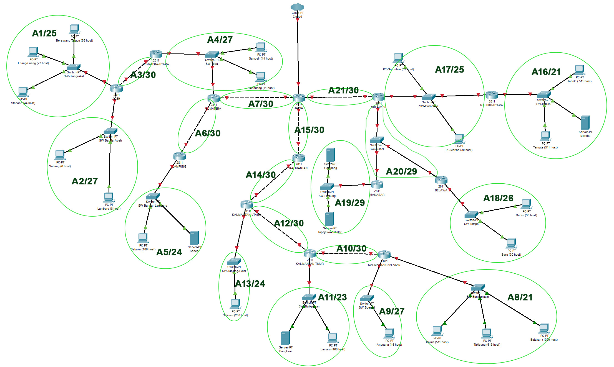

#### Langkah #2

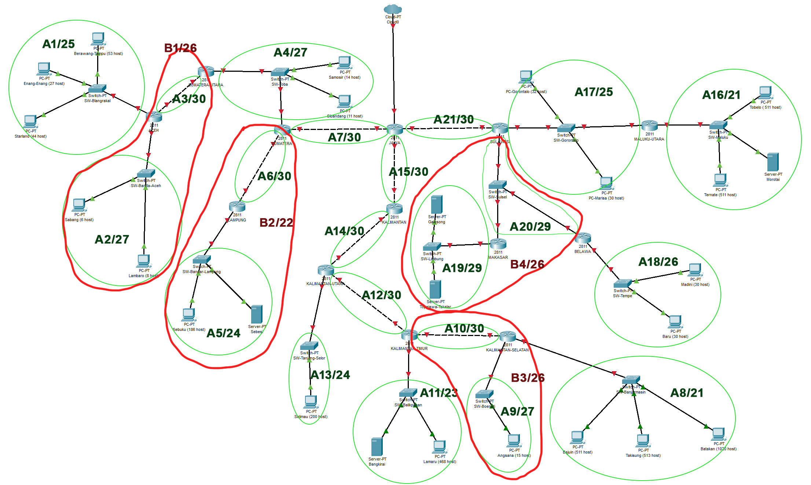

#### Langkah #3

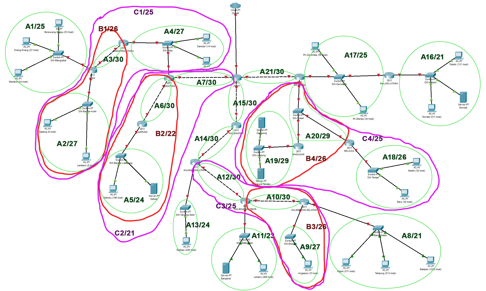

#### Langkah #4

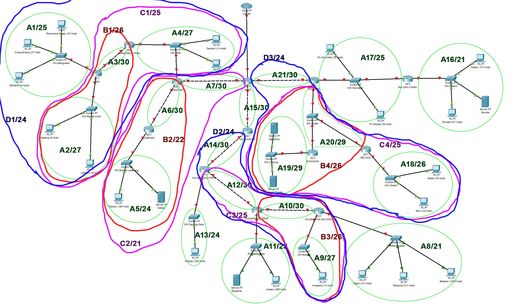

#### Langkah #5

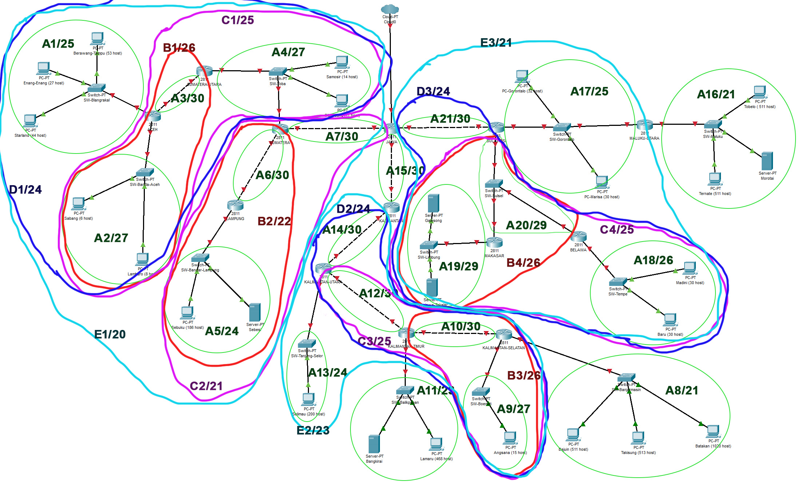

#### Langkah #6

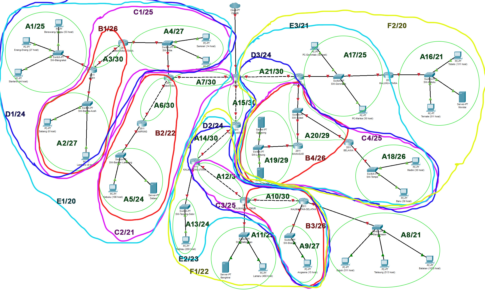

#### Langkah #7

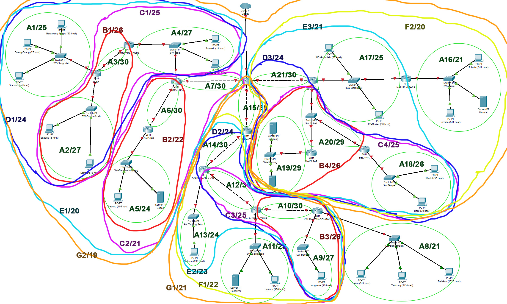

#### Langkah #8

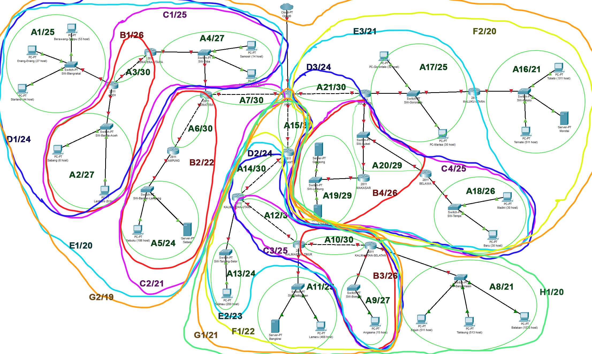

#### Langkah #9

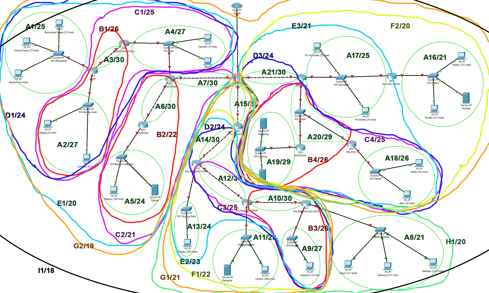

#### Tabel Netmask

Tabel penggabungan CIDR untuk memudahkan visualisasi

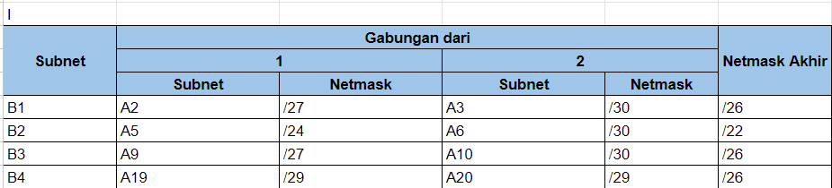

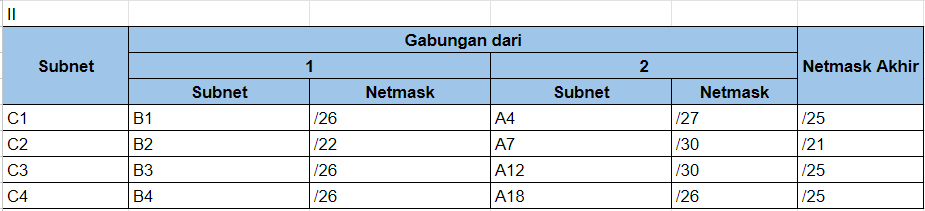

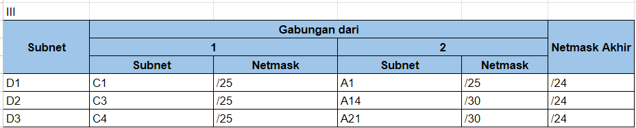

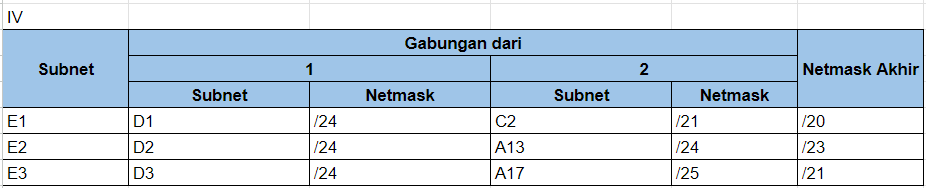

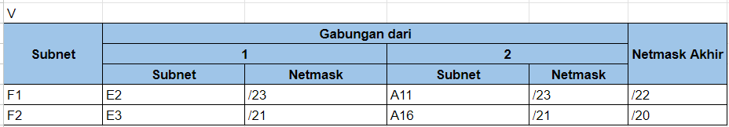

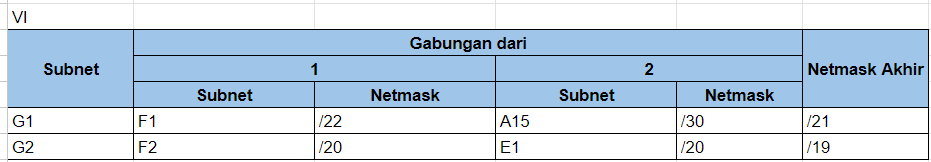

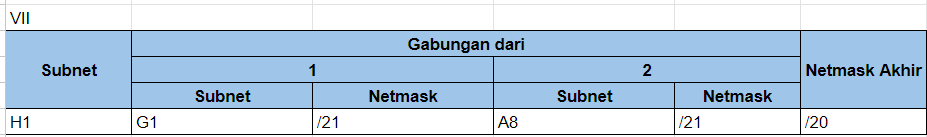

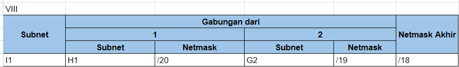

### Tree CIDR

Setelah mendapatkan netmask pada masing-masing penggabungan, maka diperoleh pula pembagian IP nya

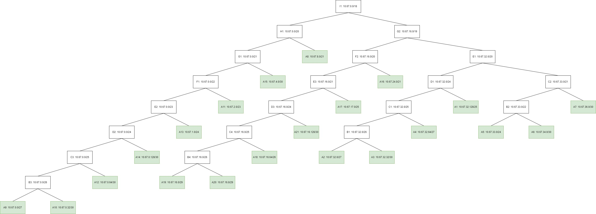

### Pembagian IP - CIDR

Adapula detail IP pada setiap subnet tertera pada tabel berikut


### Konfigurasi pada CPT

#### Router

- **JAWA**
```
Fa0/1: 10.67.36.1
Netmask: 255.255.255.252
Fa1/0: 10.67.4.1
Netmask: 255.255.255.252
Fa1/1: 10.67.16.129
Netmask: 255.255.255.252
```

#### Gateway

- **SUMATERA**
```
Fa0/0: 10.67.36.2
Netmask: 255.255.255.252
Fa0/1: 10.67.34.1
Netmask: 255.255.255.252
Fa1/0: 10.67.32.65
Netmask: 255.255.255.224
```

- **SUMATERA-UTARA**
```
Fa0/0: 10.67.32.65
Netmask: 255.255.255.224
Fa0/1: 10.67.32.33
Netmask: 255.255.255.252
```

- **LAMPUNG**
```
Fa0/0: 10.67.34.2
Netmask: 255.255.255.252
Fa0/1: 10.67.33.1
Netmask: 255.255.255.0
```

- **ACEH**
```
Fa0/0: 10.67.32.34
Netmask: 255.255.255.252
Fa0/1: 10.67.32.1
Netmask: 255.255.255.224
Fa1/0: 10.67.32.129
Netmask: 255.255.255.128
```

- **SULAWESI**
```
Fa0/0: 10.67.16.130
Netmask: 255.255.255.252
Fa0/1: 10.67.16.9
Netmask: 255.255.255.248
Fa1/0: 10.67.17.1
Netmask: 255.255.255.128
```

- **MALUKU-UTARA**
```
Fa0/0: 10.67.17.2
Netmask: 255.255.255.128
Fa0/1: 10.67.24.1
Netmask: 255.255.248.0
```

- **MAKASAR**
```
Fa0/0: 10.67.16.10
Netmask: 255.255.255.248
Fa0/1: 10.67.16.1
Netmask: 255.255.255.248
```

- **BELAWA**
```
Fa0/0: 10.67.16.11
Netmask: 255.255.248.0
Fa0/1: 10.67.16.65
Netmask: 255.255.255.192
```

- **KALIMANTAN**
```
Fa0/0: 10.67.4.2
Netmask: 255.255.255.252
Fa0/1: 10.67.0.129
Netmask: 255.255.255.252
```

- **KALIMANTAN-UTARA**
```
Fa0/0: 10.67.0.130
Netmask: 255.255.255.252
Fa0/1: 10.67.1.1
Netmask: 255.255.255.0
Fa1/0: 10.67.0.65
Netmask: 255.255.255.252
```

- **KALIMANTAN-TIMUR**
```
Fa0/0: 10.67.0.66
Netmask: 255.255.255.252
Fa0/1: 10.67.2.1
Netmask: 255.255.254.0
Fa1/0: 10.67.0.33
Netmask: 255.255.255.252
```

- **KALIMANTAN-SELATAN**
```
Fa0/0: 10.67.0.34
Netmask: 255.255.255.252
Fa0/1: 10.67.0.1
Netmask: 255.255.255.224
Fa1/0: 10.67.8.1
Netmask: 255.255.248.0
```

#### Server

- **Sebesi**
```
Fa0: 10.67.33.2
Gateway: 10.67.33.1
Netmask: 255.255.255.0
```

- **Morotai**
```
Fa0: 10.67.24.2
Gateway: 10.67.24.1
Netmask: 255.255.248.0
```

- **Galesong**
```
Fa0: 10.67.16.2
Gateway: 10.67.16.1
Netmask: 255.255.255.248
```

- **Topejawa-Takalar**
```
Fa0: 10.67.16.3
Gateway: 10.67.16.1
Netmask: 255.255.255.248
```

- **Bangkirai**
```
Fa0: 10.67.2.2
Gateway: 10.67.2.1
Netmask: 255.255.254.0
```

#### Client

- **Berawang-Tampu (53 host)**
```
Fa0: 10.67.32.130
Gateway: 10.67.32.129
Netmask: 255.255.255.128
```

- **Enang-Enang (27 host)**
```
Fa0: 10.67.32.182
Gateway: 10.67.32.129
Netmask: 255.255.255.128
```

- **Starland (44 host)**
```
Fa0: 10.67.32.208
Gateway: 10.67.32.129
Netmask: 255.255.255.128
```

- **Sabang (6 host)**
```
Fa0: 10.67.32.2
Gateway: 10.67.32.1
Netmask: 255.255.255.224
```

- **Lambaro (8 host)**
```
Fa0: 10.67.32.7
Gateway: 10.67.32.1
Netmask: 255.255.255.224
```

- **Samosir (14 host)**
```
Fa0: 10.67.32.67
Gateway: 10.67.32.65
Netmask: 255.255.255.224
```

- **Sibandang (53 host)**
```
Fa0: 10.67.32.80
Gateway: 10.67.32.65
Netmask: 255.255.255.224
```

- **Sebuku (53 host)**
```
Fa0: 10.67.33.3
Gateway: 10.67.33.1
Netmask: 255.255.255.0
```

- **Baru (30 host)**
```
Fa0: 10.67.16.66
Gateway: 10.67.16.65
Netmask: 255.255.255.192
```

- **Madini (30 host)**
```
Fa0: 10.67.16.96
Gateway: 10.67.16.65
Netmask: 255.255.255.192
```

- **Tobelo (511 host)**
```
Fa0: 10.67.24.3
Gateway: 10.67.24.1
Netmask: 255.255.248.0
```

- **Ternate (511 host)**
```
Fa0: 10.67.26.2
Gateway: 10.67.24.1
Netmask: 255.255.248.0
```

- **PC-Gorontalo (32 host)**
```
Fa0: 10.67.17.3
Gateway: 10.67.17.1
Netmask: 255.255.255.128
```

- **PC-Marisa (30 host)**
```
Fa0: 10.67.17.35
Gateway: 10.67.17.1
Netmask: 255.255.255.128
```

- **Bajuin (511 host)**
```
Fa0: 10.67.8.2
Gateway: 10.67.8.1
Netmask: 255.255.248.0
```

- **Takisung (513 host)**
```
Fa0: 10.67.10.2
Gateway: 10.67.8.1
Netmask: 255.255.248.0
```

- **Batakan (1020 host)**
```
Fa0: 10.67.12.4
Gateway: 10.67.8.1
Netmask: 255.255.248.0
```

- **Angsana (15 host)**
```
Fa0: 10.67.0.2
Gateway: 10.67.0.1
Netmask: 255.255.255.224
```

- **Lamaru (456 host)**
```
Fa0: 10.67.2.3
Gateway: 10.67.2.1
Netmask: 255.255.254.0
```

- **Selimau (200 host)**
```
Fa0: 10.67.1.2
Gateway: 10.67.1.1
Netmask: 255.255.255.0
```

### Routing pada CPT

Routing dilakukan pada setiap node router sedemikian rupa sehingga setiap node (Router, Client, dan Server) dapat terhubung satu sama lain.

- **JAWA**

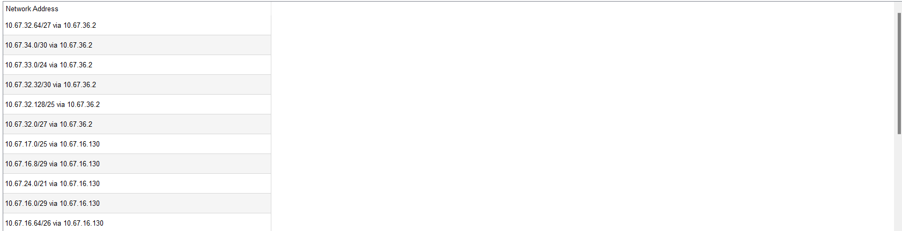

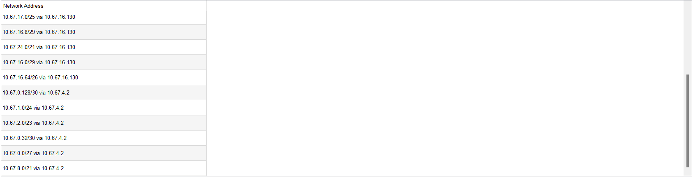

- **SUMATRA**

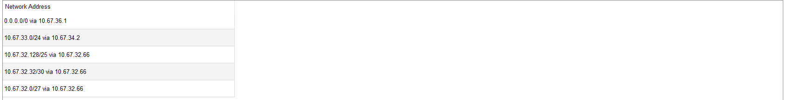

- **SUMATERA-UTARA**

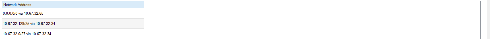

- **ACEH**

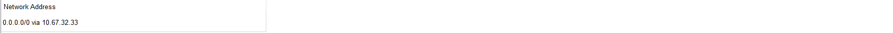

- **LAMPUNG**

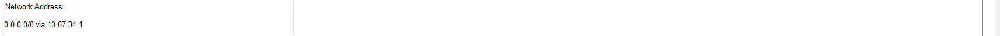

- **SULAWESI**

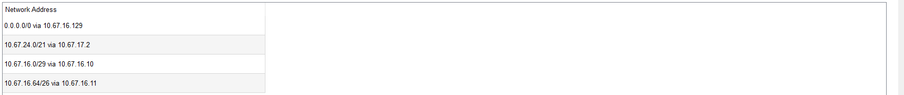

- **MALUKU-UTARA**

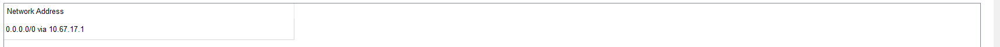

- **MAKASAR**

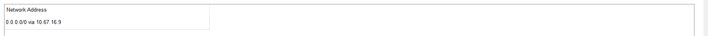

- **BELAWA**

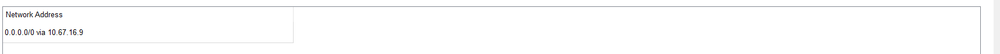

- **KALIMANTAN**

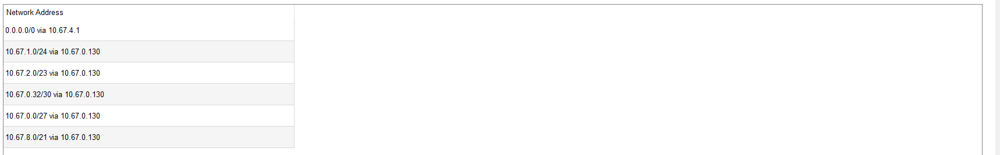

- **KALIMANTAN-UTARA**

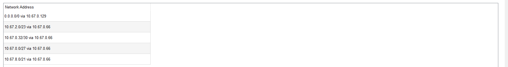

- **KALIMANTAN-TIMUR**

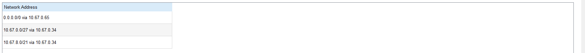

- **KALIMANTAN-SELATAN**

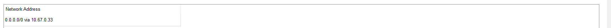
