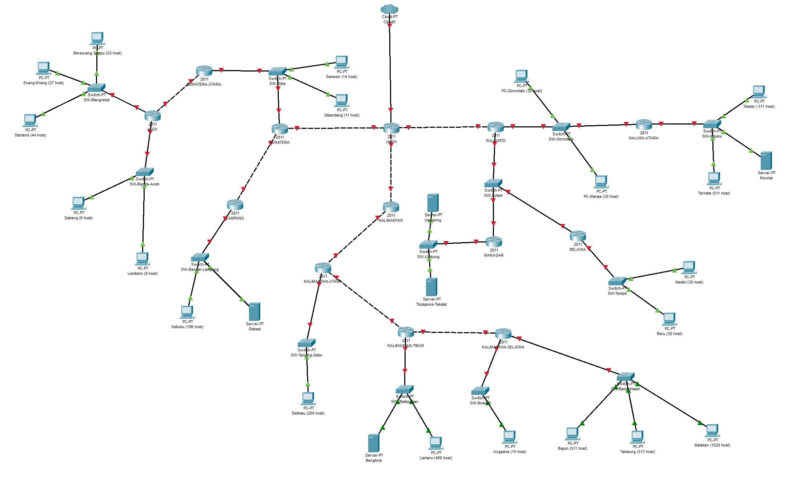
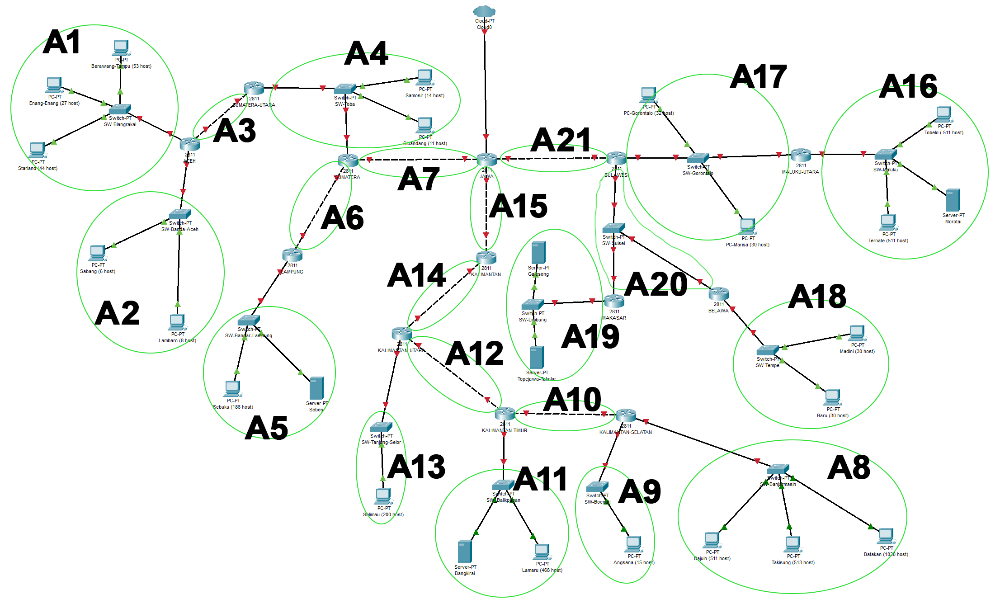

# Laporan Resmi Praktikum Jarkom Modul 2 - Kelompok IT07

| Nama              | NRP        |
| ----------------- | ---------- |
| Muhammad Afif     | 5027221032 |
| Alma Amira Dewani | 5027221054 |

## Soal

1. Soal shift dikerjakan pada `Cisco Packet Tracer` dan `GNS3` menggunakan metode perhitungan CLASSLESS yang **berbeda**.
2. Keterangan: Bila di **CPT menggunakan VLSM**, maka di **GNS3 menggunakan CIDR** atau **sebaliknya**.
3. Jika tidak ada pemberitahuan revisi soal dari asisten, berarti semua soal **BERSIFAT BENAR** dan **DAPAT DIKERJAKAN**.
4. Untuk di GNS3 `CLOUD` merupakan `NAT1` jangan sampai salah agar bisa terkoneksi internet.
5. Pembagian IP menggunakan Prefix IP yang telah ditentukan pada modul pengenalan
6. Pembagian IP dan routing harus **SE-EFISIEN MUNGKIN**.
7. Seluruh node yang ada pada topologi harus dapat **TERKONEKSI** satu sama lain dan dapat melakukan **PING** ke node lainnya yang ada di topologi
8. Gambar topologi yang lebih jelas dapat diakses pada link berikut

### Topologi



## Penyelesaian

Pembagian:

- Pada `GNS3` menggunakan `VLSM`
- Pada `CPT` menggunakan `CIDR`

### Prefix IP IT07

```bash
10.67
```

### Pelabelan Subnet



## GNS3 - VLSM

a

## CPT - CIDR

a